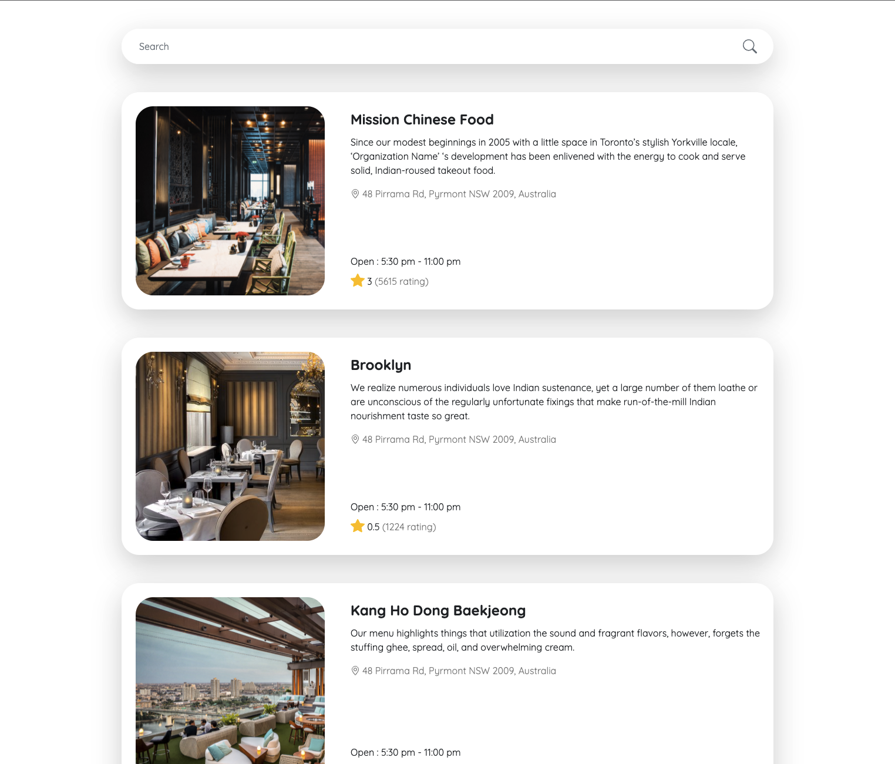

# Restaurant App Sample Project
A simple web application with Laravel + NuxtJs.



## How to run (using Docker)

Make sure you have already installed [Docker](https://www.docker.com)

Step 1 : Checkout this project to your local

Step 2 : Run command in your directory project
```
docker-compose up -d
```
Step 3 : Open your browser with url [http://localhost](http://localhost)

## License

The contents of this repository are covered under the [MIT License](LICENSE.txt).
